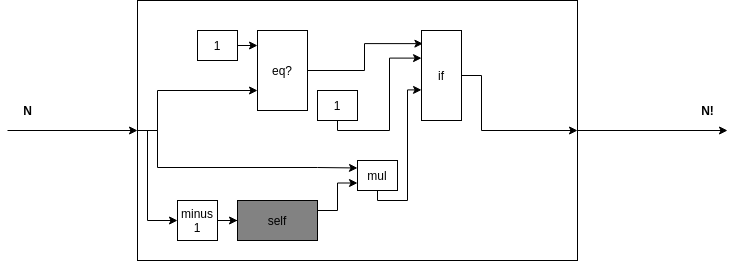

Хвостовая рекурсия. Вычисление факториала.
==========================================

На языке Racket (и многих других LISP-подобных языках)
мы можем записать функцию, вычисляющую факториал,
следующим образом:

```racket
(define (factorial n)
  (if (= n 1)
      1
      (* n (factorial (- n 1)))))
```

На Flovver более-менее похожая функция будет выглядеть следующим образом:



Здесь: 

* `eq?` - функция, сравнивающая два передаваемых аргумента, и возвращающая
`T`, если аргументы совпали;
* `mul` - функция, возвращающая произведение своих аргументов;
* `minus 1` - функция, возвращающая число на один меньшее, чем переданное параметром значение;
* `if` - функция, принимающая первым параметром значение булевого типа; вторым и третьим параметрами - в зависимости от проектирования, либо функции нулевой арности, возвращающее какое-либо значение(как в примере, стрелки идут из  нижней стороны `1` и `mul`), либо непосредственные значения (в таком случае стрелки будут идти из правых сторон `1` и `mul`). Плюс первого варианта в том, что мы явно помечаем вычисления как отложенные.
