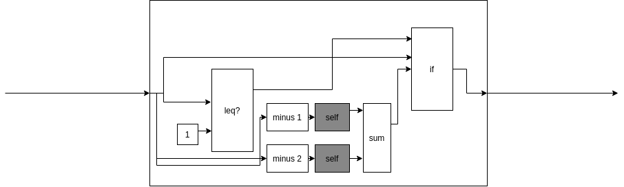

Функция Фибоначчи.
==================

На языке Racket функция вычисления N-го числа Фибоначчи выглядит следующим образом:

```racket
(define (fibonacci n)
  (if (<= n 1)
      n
      (+ (fibonacci (- n 1))
         (fibonacci (- n 2)))))
```

На Flovver функция выглядит следующим образом:



Здесь:

* `leq?` - аналог `<=`;
* `minus 1` - аналог `(lambda (n) (- n 1))`;
* `minus 2` - аналог `(lambda (n) (- n 2))`;
* `sum` - аналог `+`;
* в `if` вместо 'задумок' - простые вычисленные значения.
