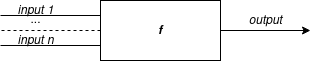
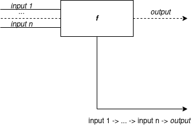
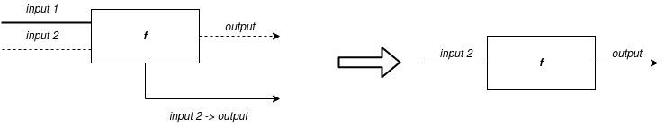
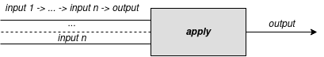
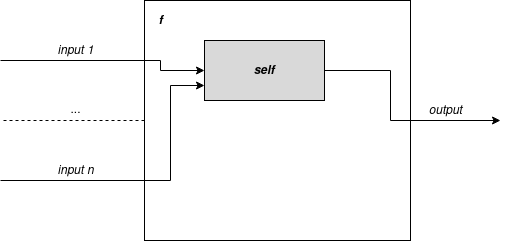

Функции. Семантика языка
========================

Flovver - аппликативный язык, то есть, вычислительный процесс в нем основывается на вычислении результата функции от заданного числа аргументов и передачи этого значения в другие функции. [Wikipedia](https://ru.wikipedia.org/wiki/Аппликативное_программирование)

На уровне семантики в языке существует всего-лишь один тип объектов - функция. 

Функция переводит от 1 до N значений заданных входящих типов в __одно__ значение выходящего типа.

В Flovver функции представлены диаграммами следующего вида:



Здесь блок _f_ - некоторая функция типа `input 1 -> ... -> input n -> output`. Левая часть блока - входы функции, правая часть блока - выход функции.

Из правой части выходит дуга, которую можно соединить с входом другой функции:


На языке Haskell аналогом диаграммы является следующий код:
```haskell
g (f x)
```

Если на вход переданы не все аргументы, считается, что функция недоопределена, и выходную дугу создать нельзя.

Функцию и переданные аргументы можно "заморозить" (на самом деле [частично применить](https://ru.wikipedia.org/wiki/Частичное_применение)), проведя дугу из нижней стороны блока к месту использования:



В результате получим из данной функцию от (нестрого) меньшего числа аргументов, ранее переданные аргументы будут зафиксированы:



Чтобы вычислить функцию, передаваемую как значение, можно использовать специальную функцию `apply`:


`apply` принимает первым параметром функцию от N аргументов, следующие 2 ... N+1 параметров - параметры, подставляемые в первую функцию:



Построение новых функций из заданных выглядит следующим образом:


Здесь блок _f_ - тело функции, левая сторона блока - входы функции, правая сторона блока - выход функции; внутри блока находится функция _g_, к которой применяются входы _f_, результат _g_ передается на выход _f_.

Для поддержки создания рекурсивных функций внутри тела функции возможно создание специального блока __self__, который является ссылкой на объявляемую функцию:



Функции с __self__ можно считать [комбинатором неподвижной точки](https://ru.wikipedia.org/wiki/Комбинатор_неподвижной_точки).